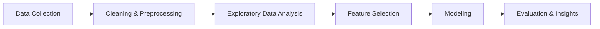

# 🎬 Movie Success Analysis & IMDb Rating Prediction

This project explores what makes a movie successful based on its features like runtime, genre, revenue, and metascore — and builds a machine learning model to **predict IMDb ratings** using Python.

---

## 🧠 Overview

Ever wondered what contributes to a movie's success?  
This data-driven project answers that question by performing in-depth exploratory data analysis (EDA) and training a regression model to predict IMDb ratings based on multiple movie features.

---

## ❓ Problem Statement

**Goal:**  
To analyze trends in movie success and **predict IMDb ratings** using features like:
- Runtime  
- Meta score  
- Gross revenue  
- Genre and more

---

## 📂 Dataset

- 📄 Source: [IMDb Top 1000 Movies Dataset on Kaggle](https://www.kaggle.com/datasets/harshitshankhdhar/imdb-dataset-of-top-1000-movies-and-tv-shows)
- 🎥 Rows: ~1000 movies  
- 🔢 Columns: Title, Genre, Runtime, Meta_score, Gross, IMDb Rating, and more

---

## 🔁 Process Workflow



---

## 📊 Exploratory Data Analysis (EDA)

A few highlights from the analysis:

- **IMDb Ratings** tend to follow a normal-ish distribution between 6.0 to 8.5.
- **Drama** and **Action** were the most common genres.
- **Metascore and Gross Revenue** had noticeable (but moderate) positive correlation with IMDb ratings.
- Applying **log transformation to Gross revenue** revealed clearer relationships due to its high variance.

<sub>*(Refer to `01_eda.ipynb` and `images/` folder for graphs.)*</sub>

---

## 🤖 Machine Learning Modeling

Two regression models were trained to predict IMDb ratings using selected features.

### 📌 1. Linear Regression
- R² Score: `0.154`
- RMSE: `0.274`

### 📌 2. Random Forest Regressor
- R² Score: `0.088`
- RMSE: `0.285`

📉 Both models struggled to accurately predict IMDb ratings.  
This suggests that the chosen features (Runtime, Meta_score, Gross) were **not sufficient** on their own to explain the variation in IMDb ratings. Non-numeric or high-impact categorical features (like cast, director, awards, genre, etc.) may play a more significant role.

---

## 📌 Key Insights

- **Gross revenue** and **metascore**, although intuitively useful, did not strongly correlate with IMDb ratings in the context of predictive modeling.
- **Runtime** had little to no predictive power.
- The **low R² values** indicate that IMDb rating prediction requires more contextual or categorical features (e.g., genre, sentiment, cast/director popularity).
- Despite the limited success of the models, this project successfully demonstrates:
  - Real-world data cleaning and preprocessing
  - Exploratory data analysis
  - Regression modeling and evaluation
  - End-to-end project workflow with clear documentation

---

## 📁 Directory Structure

```
movie-success-analysis/
│
├── data/
│   └── imdb_cleaned.csv
│
├── images/
│   └── *.png (all saved plots)
│
├── notebooks/
│   ├── 01_eda.ipynb
│   └── 02_modeling.ipynb
│
├── requirements.txt
└── README.md
```

---

## 🛠️ Tech Stack

- Python
- Pandas, NumPy
- Matplotlib, Seaborn
- Scikit-learn
- Jupyter Notebook

---

## ▶️ How to Run

1. Clone the repository:
```bash
git clone https://github.com/YOUR_USERNAME/movie-success-analysis.git
cd movie-success-analysis
```

2. Install dependencies:
```bash
pip install -r requirements.txt
```

3. Run notebooks in order:
- `notebooks/01_eda.ipynb`
- `notebooks/02_modeling.ipynb`

---

## 🚀 Future Work

- Encode **Genre** and test more models (XGBoost, Gradient Boosting)
- Add more features: **Director**, **Cast**, **Awards**, **Production Budget**
- Build a **web dashboard** to visualize trends interactively

---

## 📃 License

This project is open-source and available under the [MIT License].

---

> Developed by Mohammed Omer — aspiring Data Scientist
> [LinkedIn](https://www.linkedin.com/in/mohd-omer) | [GitHub](https://github.com/mhd-Omer)

